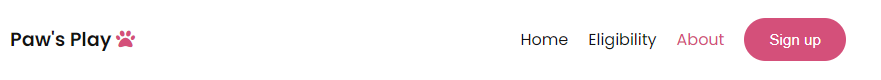
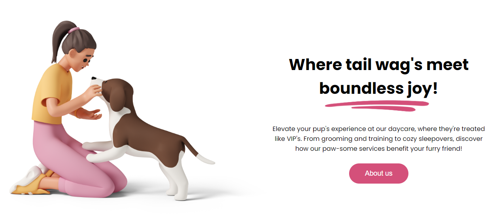

# Paw's Play

The Paw's Play website is a service for people who want a trusted day care for their dogs, with eligibility criteria that seperates it from the competition by only housing dogs that wont endanger dogs under its care.

The users of this website will be able to find all relevant information about the day care; for example an elgibility form, contact information, about paw's play and a sign up form.

## Features

#### Navigation

- Featured at the top of all pages, the navigation section shows the paw's play logo at the left corner.
- The navigation links are at the right of the navigation section; Home, Eligibility, about and sign up.
- The navigation serves it's purpose by telling the users the name of the company and links to navigate around the website.

---

#### The Header

- The left section of the header shows an illustration of a women petting a dog, setting a friendly scene and displaying its a site about dogs.
- The right section displays a header saying "Where tail wag's meet boundless joy!" further showing the users that this website and its serverices are tailored towards their dogs happiness and theirs.
- Also in the right section there is a paragraph stating that this service will elivate their dogs experience at their day care, with a button to take them to the about page to further learn about the great things that happen at paw's play day care.
- This section clearly shows the users who this website is tailored for.

