# Paw's Play

## Site Overview 

The Paw's Play website is a service for people who want a trusted day care for their dogs, with eligibility criteria that seperates it from the competition by only housing dogs that wont endanger dogs under its care.
The users of this website will be able to find all relevant information about the day care; for example an elgibility form, contact information and about paw's play.

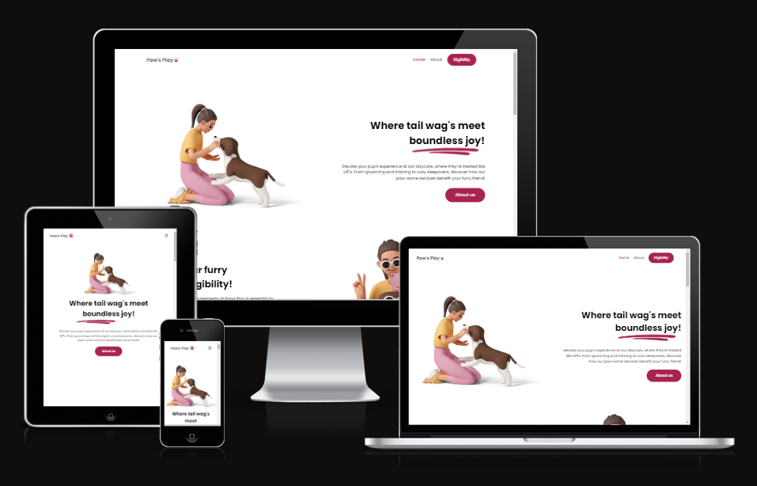

## Table of contents

1. [**Site Overview**](#site-overview)
2. [**Planning stage**](#planning-stage)
   - [**_Site aims_**](#site-aims)
   - [**_Target audience_**](#target-audience)
   - [**_User stories_**](#user-stories)
   - [**_How I will achieve this:_**](#how-i-will-achieve-this)
   - [**_Color scheme_**](#color-scheme)
3. [**Elements used on all pages**](#elements-used-on-all-pages)
   - [**Header element**](#header-element)
     - [**_Logo_**](#logo)
     - [**_Navigation_**](#navigation)
   - [**Footer element**](#footer-element)
     - [**_Contact us_**](#contact-us)
     - [**_Socials_**](#socials)
     - [**_Newsletter_**](#newsletter)
     - [**_Copyright_**](#copyright)
   - [**Typography**](#typography)
4. [**Individual page elements**](#individual-page-elements)
   - [**Home hero section**](#home-hero)
   - [**Home eligibility section**](#home-eligibility)
   - [**Home what we do best section**](#home-what-we-do-best)
   - [**Home location section**](#home-location)
   - [**Eligibility hero section**](#eligibility-hero)
   - [**Eligibility video section**](#eligibility-video)
   - [**Eligibility form section**](#eligibility-form)
   - [**About our story section**](#about-our-story)
   - [**About our mission section**](#about-our-mission)

## Planning stage 

### Site Aims: 

- Access an eligibility page to determine if your dog meets our criteria for daycare, training, and other services.
- Explore our homepage offering detailed information about our range of services, including specialized care for dogs and puppies, training programs, and more.
- Discover our specialized puppy care services, ensuring the best start for your young furry friend in a safe and nurturing environment.
- Learn about our expert-led dog training programs designed to enhance your dog's skills and behavior in various situations.
- Gain insight into our values, mission, and the passionate team behind Paw's Play on our About Us page.

### Target Audiences: 

- Users looking for a dog day care while they are away on holiday
- Users looking for a dog day care while they are at work
- Users looking for a trusted alternative to other dog day cares

### User Stories: 

- I expect clear and concise information about the page's subject matter to be prominently displayed.
- I aim to swiftly locate the information I need by easily navigating through the page.
- My goal is to leave the page feeling more informed about the subject than when I first arrived.
- I should be able to effortlessly access free resources provided on the page.
- I desire the opportunity to engage and delve deeper into the subject matter by connecting or discussing with others who share an interest in it.

## Planning stage - How i will achieve this: 

- The home page provides the user with clear information on our services and our features.

- The eligibility page provides a user with a video instructing them on which information to provide via the form below it such as

  1. General details about their dog; their name, age, breed, weight, have they been neutered or spayed and is their any existing medical conditions?
  2. Vaccination details; Is your dog up-to-date on vaccinations and have they received recent treatment for ticks/fleas?
  3. Behavior ddetails; how does your dog typically interact with other dogs and how does your dog typically interact with other people?
  4. Socialization details; have they previously attended a daycare? and do they have knowledge of commands?
  5. Owner details; first name, last name, email and phone number

- The about us page provides details of the founders and why they started paw's play to create trust with the user

- The footer provides the user with contact details for them to get in-touch

- The footer provides the user with social links so they can get to know us more

- The footer also provides the user with an optional newsletter sign up so they can recieve information on possible parties and discounts

## Color Scheme: 

When deciding a color scheme, i decided i should go with colours matching with the illustrations i got from [icons8](https://icons8.com/illustrations/animal/dog/technique--3d) i selected a pink-ish colour to compliment the illustration perfectly and used the color [grader site](https://contrast-grid.eightshapes.com/?version=1.1.0&background-colors=&foreground-colors=%23FFFFF%2C%20%0D%0A%23d298aa%0D%0A%23d56589%2C%0D%0A%23a7244e%2C%20%0D%0A%23131313%2C%20%0D%0A%2300000%0D%0A&es-color-form__tile-size=compact&es-color-form__show-contrast=aaa&es-color-form__show-contrast=aa&es-color-form__show-contrast=aa18&es-color-form__show-contrast=dnp) to check the contrast scores, using the grid showed me which background colors match with which text color so the site is accessible to everyone.

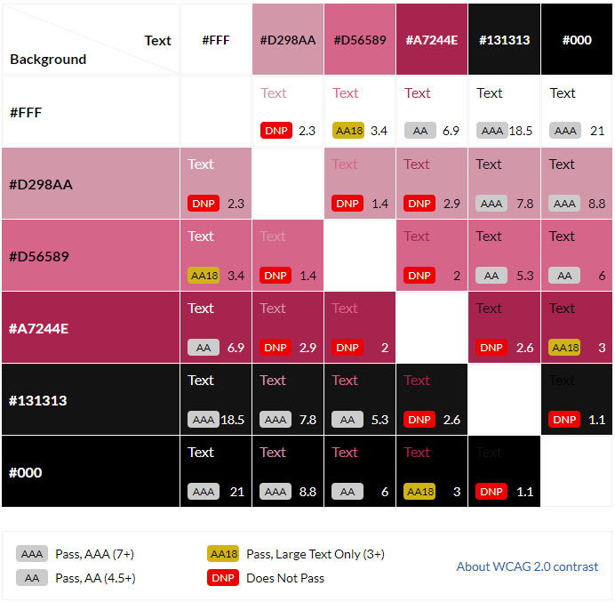;

## Elements used on all pages 

## Header Element 

The header element is stuck to the top of the page, Although it was a challanging task at the beggining of the project because of the max-width applied it was not able to align it to the middle, but now the issue is fixed. The header contains the following features:

### Logo: 

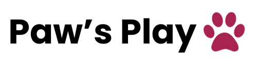

- The logo text is related to dogs with "Paws" and also being a playful and enjoyable place for dogs with "Play"
- It is also a link to the homepage

### Navigation: 

##### Navigation for screen sizes larger than 786px:

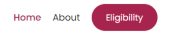

##### Navigation for screen sizes smaller than 786px:

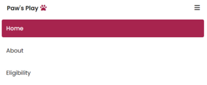

- The navigation appears on all pages.
- It contains links to home, about and eligibility.
- When the user is on a specifiv page, the link corrosponding to their page will have the class "active" and "bg-active", the "active" class applies to the links appearing on screen sizes larger than 786px and applies color and font-weight to the links, the "bg-active" class applies to the links on screen sizes smaller than 786px and applies a background colour to the links.

## Footer Element 

The footer element is at the very bottom of every page, it includes the following 4 features:

### Contact us: 

- The contact us section in the footer has a header stating its the contact us section.
- The contact us section contains 3 ways of contacting us; first being the support phone number, second being the location of the dog day care for in-person support and thirdly is the support email.

### Socials: 

- The socials section in the footer has a header stating its the socials section.
- The socials section contains 4 links that would take the user to it's 4 different accounts on various social media platforms.
- The platforms being Instagram, Youtube, Twitter and Facebook (Paw's Play doesnt actually have accounts with these platforms these are just for proof of concept)

### Newsletter: 

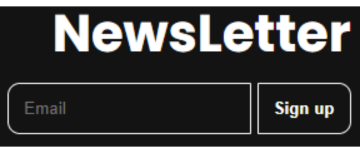

- The newsletter section in the footer has a header stating its the newsletter section.
- The newsletter section contains a input form with a button of sign up.
- Once the newsletter input is filled and submitted the user will be taken to a thank you page.

### Copyright: 

- The copyright section in the footer has a copyright icon stating its the copyright section.
- The copyright section has a "2024" mark stating its valid till 2024, this is just a dummy copyright for proof of concept.

## Typography 

- The Paw's Play site uses the font Poppins.
- Also sans-serif for a back-up font.
- The Poppins font was used because of how beautiful it is.

## Individual page elements 

### Home Hero Section Content: 

- This section is what the customer sees first so its important that the information about the site and what it does is in-front of them; and it is.
- This section contains a cheerful header catching the attention of users.
- This sections contains a paragraph telling the user that it's dog day care is like the dog version of a VIP stay.
- This section also displays an illustration of a women petting a dog, setting a joyful experience for the user.

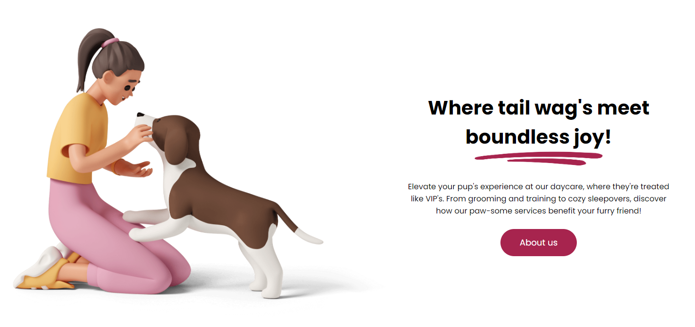

### Home Eligibility Section Content: 

- This section is how the customer is first introduced to the eligibility section through the home page.
- This section states how important the eligibility section is to Paw's Play as it is how they ensure that the day care is a safe and enjoyable environment for all dogs.
- This section also displays a joyful illustration of a women sitting with a dog, once again setting a fun and enjoyable experience.

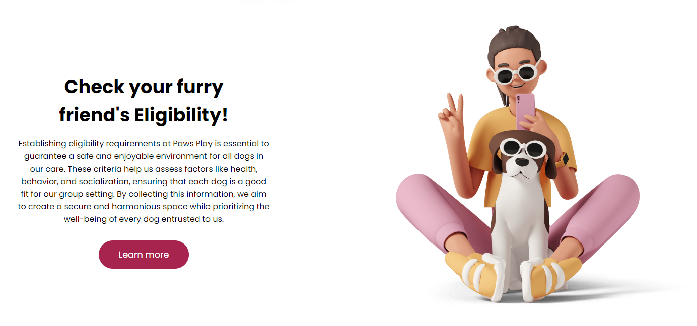

### Home What We Do Best Section Content: 

- This section tells the user what Paw's Play does best when it comes to its day care services.
- This sections key points are Dog day care, Dog training, Health and wellness and Puppy training.
- The paragraphs in each key point section describes the service provided in details.
- In every key point section there is check icons showing the guaranteed service from each key point.

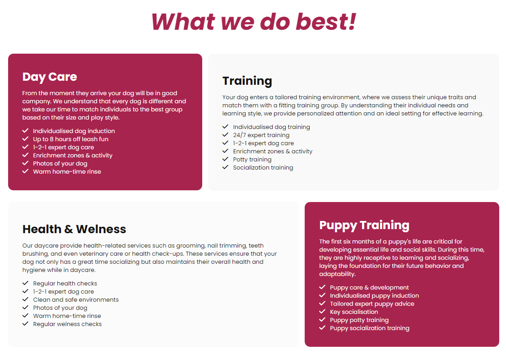

### Home Location Section Content: 

- This section shows the user the company location with a google maps location pin.
- This section has an illustration of a couple walking a dog showing its an image insinuating that they are going to the dog day care.

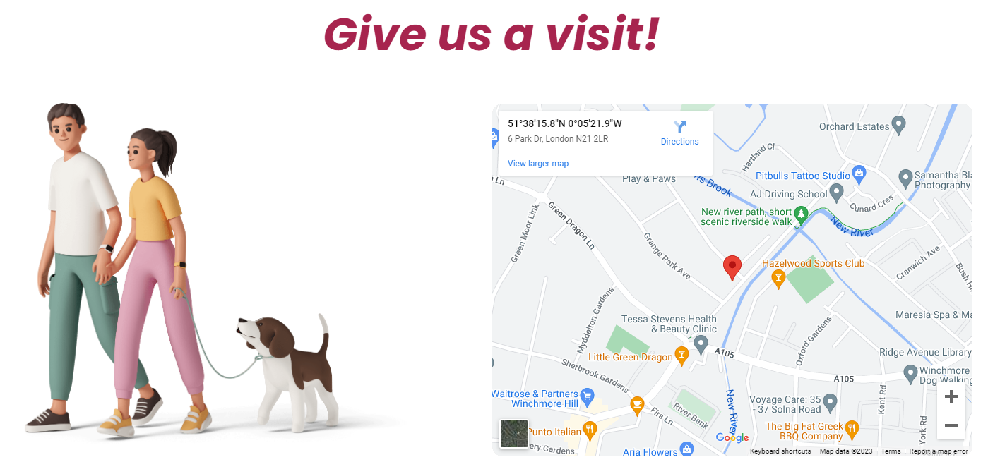

### Eligibility Hero Section Content: 

- This section shows the user the eligibility hero section with an illustration of a female veterinarian holding a dog.
- This section also displays a h2 with the text eligibility showing the users that its the eligibility section.
- This section also displays a paragraph telling the user to scroll down and fill out the eligibility form in order to sign them up with Paw's Play.

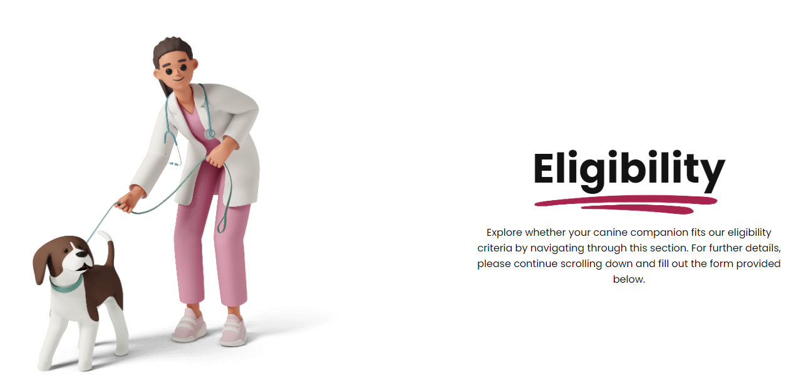

### Eligibility Video Section Content: 

- This section displays a video created for Paw's Play telling the user the eligibility requirements.
- This video was created by an animation company on Fiverr for Paw's Play.

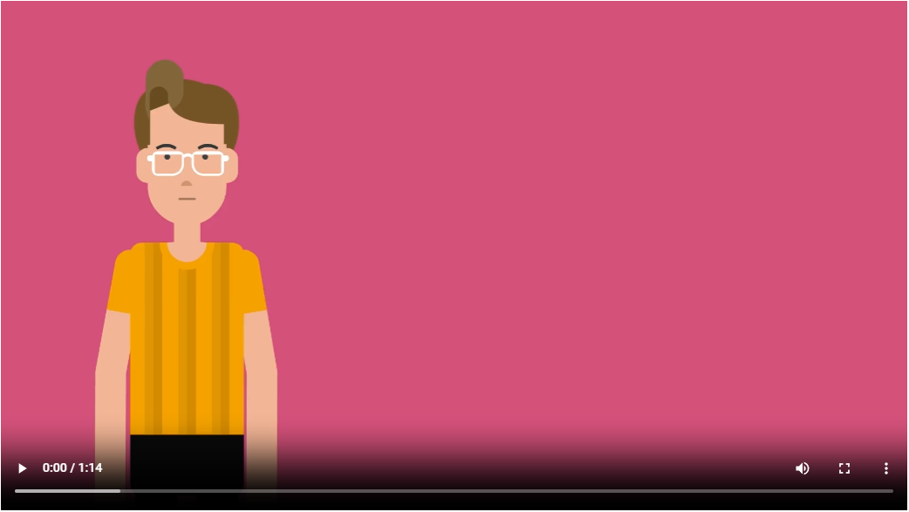

### Eligibility Form Section Content: 

- This section displays a form with 5 field-sets for the user to fill in; the legends are General Details, Vaccinations, Behavior, Socialization and Owner Detials.
- The inputs with type="text" has label's that is only visible to screen readers for ascetic's reasons.
- Once the user fill's out all required fields and clicks submit they will be navigates to the eligibility-submission.html page.

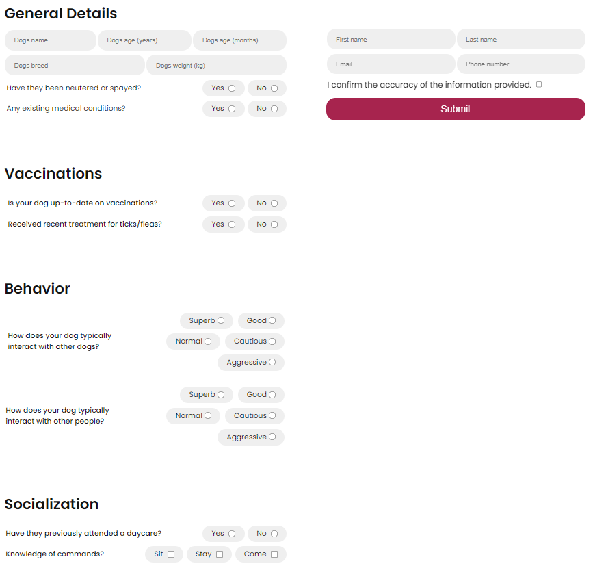

### About Our Story Section Content: 

- This section displays an illustration of the founders Grace and Thomas Shelby (yes this is a reference to the netflix series "The Peaky Blinders").
- This section also displays a paragraph of how they got started and the vision behind the company; in a short summary they both love dog's and want a safe and enjoyable environment for them.

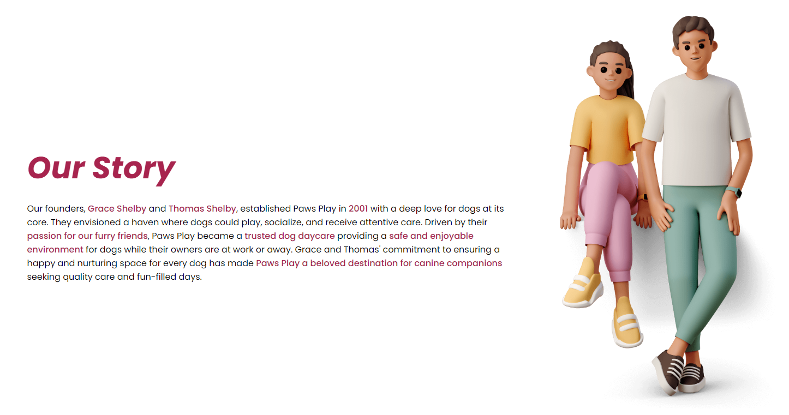

### About Our Mission Section Content: 

- This section displays an illustration of Grace and Thomas Shelby (founders) "planning" with sticky notes, showing the user a relevant image to the paragraph next to it.
- This section also displays a paragraph showing the user the mission for Paw's Play and how they transcend pet care.

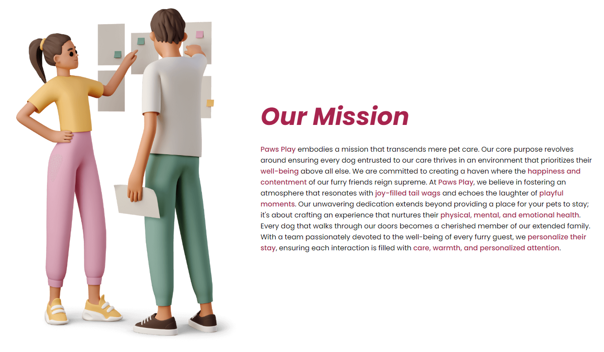
