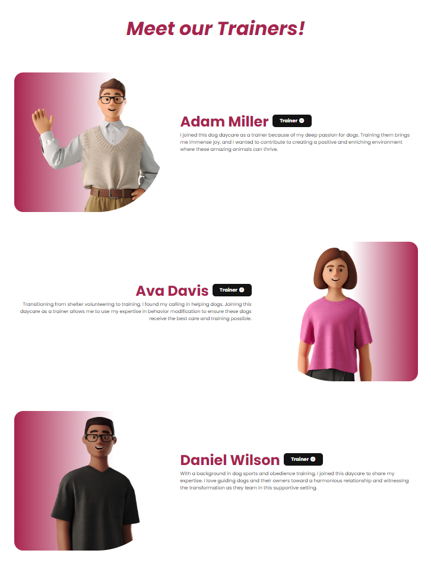
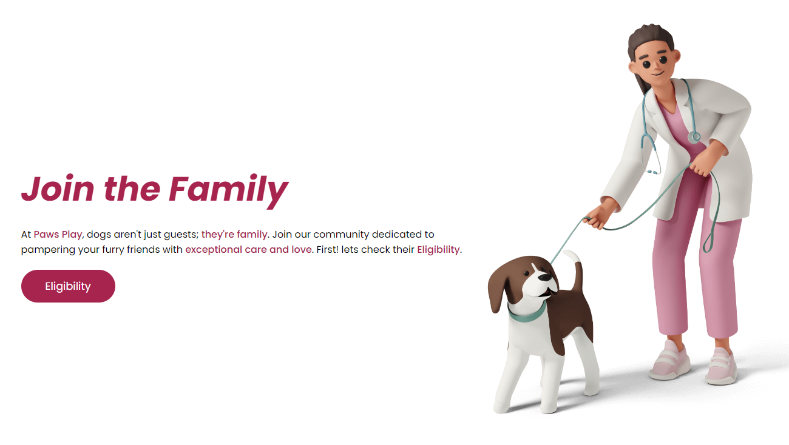

# Paw's Play

## Site Overview 

The Paw's Play website is a service for people who want a trusted daycare for their dogs, with eligibility criteria that separate it from the competition by only housing dogs that won't endanger dogs under its care.
The users of this website will be able to find all relevant information about the daycare; for example an eligibility form, contact information and about Paw's Play.

## Table of contents

1. [**Site Overview**](#site-overview)
2. [**Planning stage**](#planning-stage)
   - [**_Site aims_**](#site-aims)
   - [**_Target audience_**](#target-audience)
   - [**_User stories_**](#user-stories)
   - [**_How I will achieve this:_**](#how-i-will-achieve-this)
     - [**_Wireframes_**](#wireframes)
   - [**_Color scheme_**](#color-scheme)
3. [**Elements used on all pages**](#elements-used-on-all-pages)
   - [**Header element**](#header-element)
     - [**_Logo_**](#logo)
     - [**_Navigation_**](#navigation)
   - [**Footer element**](#footer-element)
     - [**_Contact us_**](#contact-us)
     - [**_Socials_**](#socials)
     - [**_Newsletter_**](#newsletter)
     - [**_Copyright_**](#copyright)
   - [**Typography**](#typography)
4. [**Individual page elements**](#individual-page-elements)
   - [**Home hero section**](#home-hero)
   - [**Home eligibility section**](#home-eligibility)
   - [**Home what we do best section**](#home-what-we-do-best)
   - [**Home location section**](#home-location)
   - [**Eligibility hero section**](#eligibility-hero)
   - [**Eligibility video section**](#eligibility-video)
   - [**Eligibility form section**](#eligibility-form)
   - [**About our story section**](#about-our-story)
   - [**About our mission section**](#about-our-mission)
   - [**About our trainer's section**](#about-our-trainers)
   - [**About join the family section**](#about-join-the-family)
5. [**Future enhancements**](#future-enhancements)
6. [**Testing phase**](#testing-phase)
7. [**Deployment**](#deployment)
8. [**Credits**](#credits)
   - [**_Honorable mentions_**](#honorable-mentions)
   - [**_General reference_**](#general-reference)
   - [**_Content_**](#content)
   - [**_Media_**](#media)

## Planning stage 

### Site Aims: 

- Access an eligibility page to determine if your dog meets our criteria for daycare, training, and other services.
- Explore our homepage offering detailed information about our range of services, including specialized care for dogs and puppies, training programs, and more.
- Discover our specialized puppy care services, ensuring the best start for your young furry friend in a safe and nurturing environment.
- Learn about our expert-led dog training programs designed to enhance your dog's skills and behavior in various situations.
- Gain insight into our values, mission, and the passionate team behind Paw's Play on our About Us page.

### Target Audiences: 

- Users looking for a dog daycare while they are away on holiday
- Users looking for a dog daycare while they are at work
- Users looking for a trusted alternative to other dog day care's

### User Stories: 

- I expect clear and concise information about the page's subject matter to be prominently displayed.
- I aim to swiftly locate the information I need by easily navigating through the page.
- My goal is to leave the page feeling more informed about the subject than when I first arrived.
- I should be able to effortlessly access the free resources provided on the page.
- I desire the opportunity to engage and delve deeper into the subject matter by connecting or discussing with others who share an interest in it.

## Planning stage - How I will achieve this: 

- The home page provides the user with clear information on our services and our features.

- The eligibility page provides a user with a video instructing them on which information to provide via the form below it such as

  1. General details about their dog; their name, age, breed, weight, have they been neutered or spayed and are there any existing medical conditions?
  2. Vaccination details; Is your dog up-to-date on vaccinations and have they received recent treatment for ticks/fleas?
  3. Behavior details; how does your dog typically interact with other dogs and how does your dog typically interact with other people?
  4. Socialization details; have they previously attended a daycare? and do they have knowledge of commands?
  5. Owner details; first name, last name, email and phone number

- The About Us page provides details of the founders and why they started Paw's play to create trust with the user

- The footer provides the user with contact details for them to get in touch

- The footer provides the user with social links so they can get to know us more

- The footer also provides the user with an optional newsletter sign-up so they can receive information on possible parties and discounts

### Wireframes: 

To organize my thoughts I created wireframes for this project. Below are links to each of the mobile and desktop versions of my site.

- Desktop wireframes:
  - [Home page](assets/images/readme/wireframes/paws-play-homepage.png)
  - [About page](assets/images/readme/wireframes/paws-play-about-page.png)
  - [Eligibility page](assets/images/readme/wireframes/paws-play-eligibility-page.png)
  - [Eligibility submission page](assets/images/readme/wireframes/paws-play-eligibility-submission.png)
  - [Newsletter page](assets/images/readme/wireframes/paws-play-newsletter-page.png)
- Mobile wireframes:
  - [Home page](assets/images/readme/wireframes/paws-play-mobile-homepage.png)
  - [About page](assets/images/readme/wireframes/paws-play-mobile-aboutpage.png)
  - [Eligibility page](assets/images/readme/wireframes/paws-play-mobile-eligibility-page.png)
  - [Eligibility submission page](assets/images/readme/wireframes/paws-play-mobile-eligibility-submission-page.png)
  - [Newsletter page](assets/images/readme/wireframes/paws-play-mobile-newsletter-submission-page.png)

## Color Scheme: 

When deciding on the color scheme, I decided I should go with colors matching the illustrations I got from [icons8](https://icons8.com/illustrations/animal/dog/technique--3d) i selected a pink-ish color to compliment the illustration perfectly and used the color [grader site](https://contrast-grid.eightshapes.com/?version=1.1.0&background-colors=&foreground-colors=%23FFFFF%2C%20%0D%0A%23d298aa%0D%0A%23d56589%2C%0D%0A%23a7244e%2C%20%0D%0A%23131313%2C%20%0D%0A%2300000%0D%0A&es-color-form__tile-size=compact&es-color-form__show-contrast=aaa&es-color-form__show-contrast=aa&es-color-form__show-contrast=aa18&es-color-form__show-contrast=dnp) to check the contrast scores, using the grid showed me which background colors match with which text color so the site is accessible to everyone.

;

## Elements used on all pages 

## Header Element 

The header element is stuck to the top of the page, Although it was a challenging task at the beginning of the project because of the max-width applied it was not able to align it to the middle, but now the issue is fixed. The header contains the following features:

### Logo: 

- The logo text is related to dogs with "Paws" and also being a playful and enjoyable place for dogs with "Play"
- It is also a link to the homepage

### Navigation: 

##### Navigation for screen sizes larger than 786px:

##### Navigation for screen sizes smaller than 786px:

- The navigation appears on all pages.
- It contains links to home, about and eligibility.
- When the user is on a specific page, the link corresponding to their page will have the classes "active" and "bg-active", the "active" class applies to the links appearing on screen sizes larger than 786px and applies color and font-weight to the links, the "bg-active" class applies to the links on screen sizes smaller than 786px and applies a background color to the links.

## Footer Element 

The footer element is at the very bottom of every page, it includes the following 4 features:

### Contact us: 

- The Contact Us section in the footer has a header stating it's the Contact Us section.
- The Contact Us section contains 3 ways of contacting us; the first is the support phone number, the second is the location of the dog daycare for in-person support and the third is the support email.

### Socials: 

- The socials section in the footer has a header stating it's the socials section.
- The socials section contains 4 links that would take the user to its 4 different accounts on various social media platforms.
- The platforms are Instagram, YouTube, Twitter and Facebook (Paw's Play doesn't have accounts with these platforms these are just for proof of concept)

### Newsletter: 

- The newsletter section in the footer has a header stating it is the newsletter section.
- The newsletter section contains an input form with a button for sign-up.
- Once the newsletter input is filled and submitted the user will be taken to a thank you page.

### Copyright: 

- The copyright section in the footer has a copyright icon stating it is the copyright section.
- The copyright section has a "2024" mark stating it is valid till 2024, this is just a dummy copyright for proof of concept.

## Typography 

- The Paw's Play site uses the font Poppins.
- Also sans-serif for a back-up font.
- The Poppins font was used because it compliments the site's overall look, furthermore, it adds a modern feel which is industry standard in today's day and age.

## Individual page elements 

### Home Hero Section Content: 

- This section is what the customer sees first so it is important that the information about the site and what it does is in front of them and it is.
- This section contains a cheerful header that catches the attention of users.
- This section contains a paragraph telling the user that it is dog daycare is like the dog version of a VIP stay.
- This section also displays an illustration of a woman petting a dog, setting a joyful experience for the user.

### Home Eligibility Section Content: 

- This section is how the customer is first introduced to the eligibility section through the home page.
- This section states how important the eligibility section is to Paw's Play as it is how they ensure that the daycare is a safe and enjoyable environment for all dogs.
- This section also displays a joyful illustration of a woman sitting with a dog, once again setting a fun experience.

### Home What We Do Best Section Content: 

- This section tells the user what Paw's Play does best when it comes to its daycare services. This section's key points are Dog daycare, Dog training, Health and wellness and Puppy training.
- The paragraphs in each key point section describe the service provided in detail.
- In every key point section, check icons show the guaranteed service from each key point.

### Home Location Section Content: 

- This section shows the user the company location with a Google Maps location pin.
- This section has an illustration of a couple walking a dog showing an image insinuating that they are going to the dog daycare.

### Eligibility Hero Section Content: 

- This section shows the user the eligibility hero section with an illustration of a female veterinarian holding a dog.
- This section also displays an h2 with the text eligibility showing the users that it's the eligibility section.
- This section also displays a paragraph telling the user to scroll down and fill out the eligibility form to sign them up with Paw's Play.

### Eligibility Video Section Content: 

- This section displays a video created for Paw's Play telling the user the eligibility requirements.
- This video was created by an animation company on Fiverr for Paw's Play.

### Eligibility Form Section Content: 

- This section displays a form with 5 field sets for the user to fill in; the legends are General Details, Vaccinations, Behavior, Socialization and Owner Details.
- The inputs with type="text" have labels that are only visible to screen readers for ascetic reasons.
- Once the user fills out all required fields and clicks submit they will be navigated to the eligibility-submission.html page.

### About Our Story Section Content: 

- This section displays an illustration of the founder's Grace and Thomas Shelby (yes this is a reference to the Netflix series "The Peaky Blinders").
- This section also displays a paragraph of how they got started and the vision behind the company; in a short summary they both love dogs and want a safe and enjoyable environment for them.

### About Our Mission Section Content: 

- This section displays an illustration of Grace and Thomas Shelby (founders) "planning" with sticky notes, showing the user a relevant image to the paragraph next to it.
- This section also displays a paragraph showing the user the mission of Paw's Play and how it transcends pet care.

### About Our Trainers Section Content: 

- This section displays 3 sections containing information about the 3 trainers at Paw's Play.
- Each section has an illustration of the trainer, their name, their profession and their biography.

### About Join The Family Section Content: 

- This section displays an illustration similar to the one for the eligibility hero section to convey they are related.
- This section has a header saying "Join the Family" to convey that once you are a customer with Paw's Play, you become a family member too.
- This section also has a paragraph that conveys the message from the header and also has a call to action to navigate the user to the eligibility page.

## Future-Enhancements 

- The future intentions of this website will be a landing page for anyone looking for a dog daycare in the north London area. The functionality I want to add in the future is a database where the user's eligibility submissions could go, with the data Paw's Play obtains we can easily know everything that we need to know to follow up with customers who are interested in our services.
- Once I learn JavaScript I would love to add a sign-up page where users can join the Paw's Play community.
- I would also love to make a Paw's Play app where owners can see their dog's day-to-day achievements regarding new tricks and new commands they have learned; Also a section where they can see a live broadcast of the main hall where the dogs are kept so they can see what their pooch is doing whenever they want.

## Testing Phase 

I have moved the details for the testing of the Paw's Play site to [Testing.md](./TESTING.md)

## Deployment 

I deployed the site on GitGub using the following procedure:

1. Once on the project's repository, I clicked on the _settings_ tab.
2. Then select the _Pages_ tab.
3. Then under the _Source_ section, I selected the _Main_ branch from the dropdown menu and clicked _Save_.
4. After a few minutes, the page was deployed.

Link to the [live site](https://ilyasolgun11.github.io/paws-play-pp1/index.html).

## Credits 

### Honorable mentions: 

This project could not have happened without the support of the following people listed in no particular order:

- David Bowers - My mentor David has been amazing in guiding me on how I can make an amazing project, if I get a distinction it is because of him.
- Patrick Hladun - Tester and advisor, gave me some amazing tips on how I can improve my site.
- Benjamin Schäfer - Tester and advisor, also gave me some amazing tips and pointed out bugs that I wouldn't have seen otherwise.
- Ayisha Sandiford - Tester and advisor, pointed out some bugs I did not notice, really helpful!

### General reference: 

The only piece of code I was inspired by and modified was the navigation toggle functionality from the love-running project.

### Content: 

- All contents for this project have been inspired by Chat.GPT, and modified for this project by me.
- All icons used are from [Font Awesome](https://fontawesome.com/)
- Fonts were imported from [Google fonts](https://fonts.google.com/)

### Media 

- Site:
  - Illustrations were taken from [Icons8](https://icons8.com/illustrations)
  - Eligibility form explainer video from [Fiverr](https://www.fiverr.com/) and it has been paid for and created by [Jump and Team](https://www.fiverr.com/jump_explainer/create-2d-animated-explainer-video-for-your-business?source=order_page_summary_gig_link_image&funnel=f84e587059164b9f98b4012a1686ac48)
  - Google Maps API by [Google](https://developers.google.com/maps/documentation/javascript/get-api-key)
- README:
  - Color grid contrast tool - [Eightshapes](https://contrast-grid.eightshapes.com/?version=1.1.0&background-colors=&foreground-colors=%23FFFFFF%2C%20White%0D%0A%23F2F2F2%0D%0A%23DDDDDD%0D%0A%23CCCCCC%0D%0A%23888888%0D%0A%23404040%2C%20Charcoal%0D%0A%23000000%2C%20Black%0D%0A%232F78C5%2C%20Effective%20on%20Extremes%0D%0A%230F60B6%2C%20Effective%20on%20Lights%0D%0A%23398EEA%2C%20Ineffective%0D%0A&es-color-form__tile-size=compact&es-color-form__show-contrast=aaa&es-color-form__show-contrast=aa&es-color-form__show-contrast=aa18&es-color-form__show-contrast=dnp)
  - File compression tool - [Tinypng](https://tinypng.com/)
  - File converter tool - [Pixelied](https://pixelied.com/convert/png-converter/png-to-webp)
  - README structure - Inspired by David Bower's [project](https://github.com/dnlbowers/modern-buddhism/blob/main/README.md)
