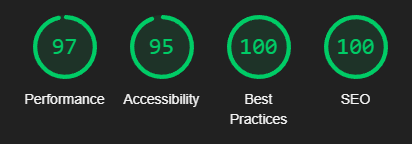
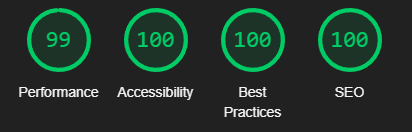

# Testing Page Table of Contents

- [**During Development Testing**](#during-development-testing)
  - [**_Manual testing_**](#during-development-manual-testing)
  - [**_Bugs & fixes_**](#during-development-bugs-fixes)
- [**Post Development Testing**](#post-development-testing)
  - [**_Validators_**](#validators)
    - [**_HTML_**](#HTML)
    - [**_CSS_**](#CSS)
- [**Lighthouse Scores**](#lighthouse-scores)
  - [**_Testing conditions_**](#test-conditions)
  - [**_Desktop version_**](#desktop-version)
  - [**_Mobile version_**](#mobile-version)

## During Development Testing 

During development i tested my project in various ways such as:

1. Manually testing each element's appearance and responsiveness using the chrome dev tools.
2. Used the peer-code-review channel on slack to get feedback from my fellow students and teachers.

### Manual Testing: 

- During testing i used 3 different browsers to ensure cross-compatibility such as:

  1. Google chrome
  2. Opera GX
  3. Bing

- I then used the dev tools on these browsers to test different screen sizes for for responsiveness.

## Bugs and Fixes 

1. Intended Outcome - For the nav section to stick to the top of the page and for it to shrink for different view-ports and also remain fixed to the top of the page when the user scroll's down.
   - Issue:
     - I was not able to stick the navigation to the top of the page without it being stuck to the left side of the page and not shrink to fit other view-ports.
   - Solution:
     - I wrapped the navigation inside a container which i applied display:flex and justify-content:center to and i applied max-width:1400px to the navigation itself.
2. Intended Outcome - For there to only be vertical scroll and no horizontal scroll on all view-ports.
   - Issue:
     - The images would overflow out of the view-port on small screen sizes and create horizontal scroll.
   - Solution:
     - I manually checked each image using the chrome dev tools to see which images overflowed out of the viewport and decreased their width to fit on smaller screen sizes.
3. Intended Outcome - For the owner details container in the eligibility form section to stick to the top of the page while the user scroll' down (on screen sizes larger than 998px).
   - Issue:
     - I did not have anything for the owner details div to stick to while the user was scrolling down.
   - Solution:
     - I added a div underneath the owners details div and gave it a width and height of 100% to fill in the open space, now when the owners details div is at the very top of the page and the user scrolls down, it overflows into the new div underneath, it also stops overflowing then the user scrolls past the entire section.
4. Intended Outcome - For when the user hovers over the logo, i wanted the paw icon next to it to rotate 45 degrees so it looks like the paw is waving.
   - Issue:
     - When i hovered over the logo, the entire logo rotated.
   - Solution:
     - I added the ":hover" pseudo code next to the logo like this ".logo:hover" and then after that i targeted the paw itself like this ".logo:hover .fa-paw"
5. Intended Outcome - For all used in the site to not be blurry.
   - Issue:
     - I was setting "%" as width for all the images so they shrink and grow when the screen size itself shrinks and grows
   - Solution:
     - I set min and max width's for all images and only used "px", i also adjusted the min and max width's for different screen sizes.
6. Intended Outcome - For the imaginary location for Paw's Play to show up in a map for the users to find in the location section.
   - Issue:
     - I was not familiar with google maps or API's so i was not sure how to achieve this.
   - Solution:
     - I used google to find the google maps api and created myself an API key, i also used google to find the url structure so i can use the latitude and longitude of the location and add it to the url.

## Post Development Testing 

### Validators 

_HTML_ - [https://validator.w3.org/nu/](https://validator.w3.org/nu/) 

- All pages tested, no issue found.

_CSS_ - [https://jigsaw.w3.org/css-validator/](https://jigsaw.w3.org/css-validator/) 

- All pages tested, no issue found.

## Lighthouse Scores 

### Test Conditions 

- I did all lighthouse tests in incognito mode to avoid interference from browser extensions.
- I ran the tests for both mobile and desktop.

### Desktop version 

1. _index.html:_

2. _about.html:_

3. _eligibility.html:_

4. _eligibility-submission.html:_

5. _newsletter.html:_

### Mobile version 

1. _index.html:_

- For the mobile version of the site the images are still too big according to the lighthouse score, this score was initially in the 65/76 range, i brought this up to 85/89 range by converting all images from png to webp and also compressing the files, but i still didn't get above 90. I was also not able to compress then any further.

2. _eligibility.html:_

3. _about.html:_

- For the mobile version i have the same issue as the index.html but there is more photos in this file so the score is around 81-85.

4. _eligibility-submission.html:_

5. _newsletter.html:_

## Accessability

In addition to the accessability score on light house I also used [WAVE - Web accessability evaluation tool](https://wave.webaim.org/) to check my pages for accessability and no errors were returned.

### [Return to README.md](./README.md)
